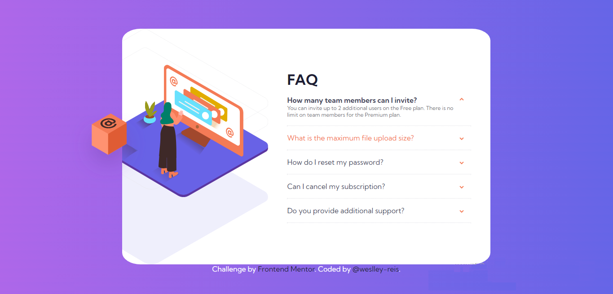

<h1 align="center"> Frontend Mentor - FAQ accordion card solution</h1>

 Esta é uma solução para o desafio [FAQ accordion card challenge on Frontend Mentor](https://www.frontendmentor.io/challenges/faq-accordion-card-XlyjD0Oam).

## Tabela de conteudos

- [Overview](#overview)
  - [O Desafio](#o-desafio)
  - [Screenshot](#screenshot)
  - [Links](#links)
- [Meu processo](#meu-processo)
  - [Recursos utilizados](#recursos-utilizados)
- [Author](#autor)

## Overview

### O Desafio

Os usuários devem ser capazes de:

- Visualizar o layout ideal para o componente, dependendo do tamanho da tela do dispositivo.
- Ver os estados de focos para todos os elementos interativos na página.
- Ocultar/Mostrar as respostas ao clicar nas questões

### Screenshot

### Links

- Live Site URL: [GitHub Pages](https://weslley-reis.github.io/faq-accordion-card-main/)

## Meu Processo

### Recursos utilizados

- Semantic HTML5 markup
- CSS custom properties
- Flexbox
- JavaScript

## Autor

- GitHub - [@weslley-reis](https://github.com/weslley-reis)
- Linkedin - [Weslley Reis](https://www.linkedin.com/in/weslley-reis-ba1ab6156/)
